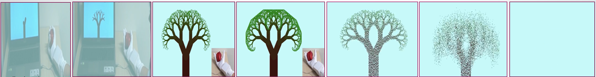

# Heartbeat Visualization through Tangible Interaction

## Motivation
<ul>
  <li>In the present era, many people are dying of heart failure. Coronary artery disease is the most common form of heart disease and the most common cause of heart failure.
  The disease results from the buildup of fatty deposits (plaque) in our arteries, which reduce blood flow and can lead to heart attack. 
  </li>
  <li>With our project, we will see the heartbeat of any person on our computer screen and the human heartbeat will be displayed on the screen by converting it to a tree 
  structure. When creating constant stable heart beats, will grow a healthy green tree on our screen. On the other side, when creating fast heart beats, will grow a dried and 
  short looking tree on our screen.
  </li>
  <li>With the structure of the tree, we can know whether the person has a normal heartbeat or not. That will help us take the next step.</li>
  <li>In a word, our project can give anybody an idea of their heartbeat condition, which will play a big role in the medical field.</li>
</ul>

## List of component

The elements we have used in our project are:

<ul>
  <li>Physical Agent (heart)</li>
  <li>Flex Sensor (inside a glove)</li>
  <li>Arduino Uno (board)</li>
</ul>

## Conceptual Diagram

Using a tangible user interface we recognize two gestures.  Physically squeezing the heart, affects the tree's growth on screen.  Switching between the two gestures allows 
the user to control the tree's growth and make each tree grow in a different and distinct way.  Once we stop squeezing the heart, the tree will fall apart.

### Gestures

Gesture I – pressing the heart slowly. Creating constant stable heart beats, will grow a healthy green tree. we stop squeezing the heart, the tree  will fall apart.

Gesture II – pressing the heart rapidly. Creating fast heart beats, will grow a dried and short looking tree.

## Physical Diagram
### Arduino

### Design Flow

